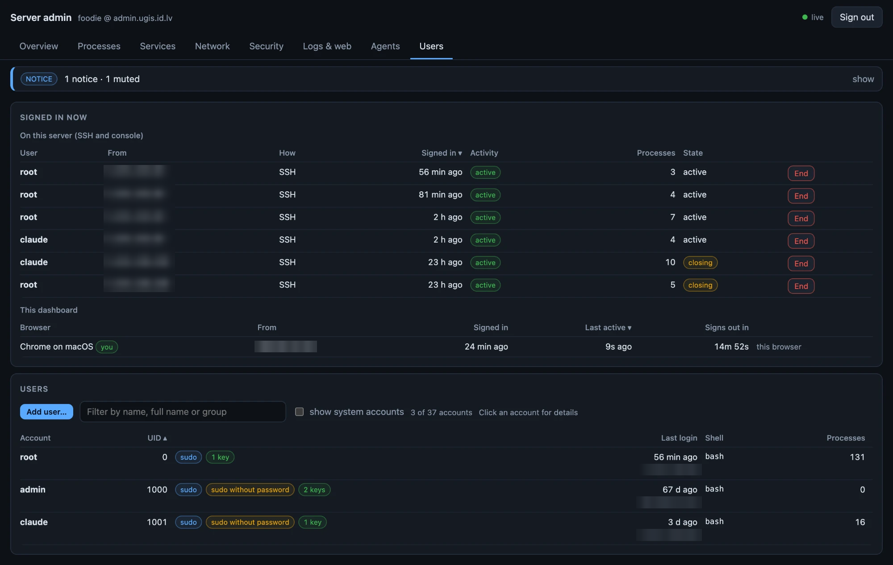
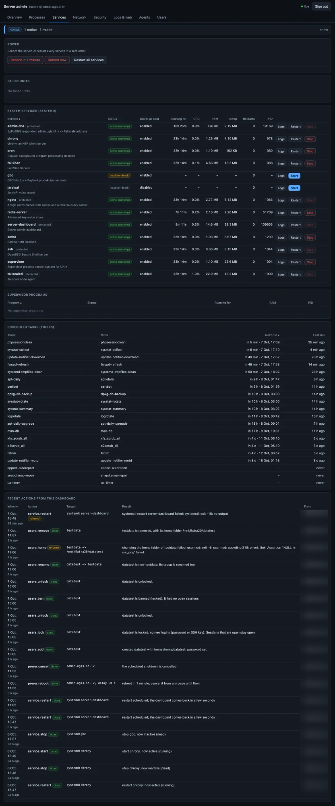
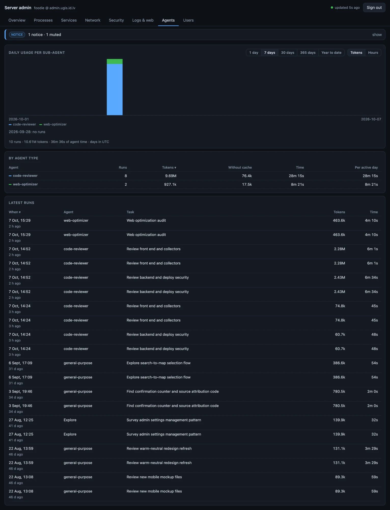

# Server admin dashboard

Live, detailed monitoring and control for this server at **https://admin.example.com**, reachable only over Tailscale. Python standard library only, with no dependencies to install.

The full build plan and design are in [PLAN.md](PLAN.md).

The code lives in a private GitHub repository, `ProgrammerFoodie/serveradmindash`. The server pushes with a deploy key limited to that repository (private key `~/.ssh/server_admin_dashboard_deploy_2`, set as `core.sshCommand` in `.git/config`, so `git push` also works as root). Never commit `config.json` or `data/`; both are in `.gitignore`.

## Screenshots

IP addresses are blurred.

| Users | Services |
|---|---|
|  |  |



## Status

Built, installed and verified on 2026-10-06, including a reboot.

- [x] Phases 1-8: skeleton, collectors, history, web server and login, interface, alerts and Telegram, actions, DNS responder
- [x] Phases 9-11: nginx site and certificate, systemd services, Tailscale Split DNS
- [x] Phase 12: alert drill (Telegram alert and recovery), reboot check, data disk added to `/etc/fstab`
- [ ] Last step: `chown -R root:root` on this folder (see "Locking it down")

## Operating it

| Task | How |
|---|---|
| Open it | https://admin.example.com with Tailscale on (laptop or phone) |
| Change the login password | `sudo python3 -m dashboard set-password`, then `sudo systemctl restart server-dashboard` |
| Change the inactivity sign-out (default 15 min) | set `auth.idle_minutes` (1 to 1440) in `config.json`, then restart the service |
| Change Telegram or alert settings | edit `config.json` as root, then `sudo systemctl restart server-dashboard` (the config is read at start) |
| Update the code | `git pull` (as the folder owner), then `sudo systemctl restart server-dashboard` |
| Dashboard logs | `journalctl -u server-dashboard -f` |
| What was done from the UI | the Services tab, or `data/audit.jsonl` |
| Back up | only `config.json` matters; history, alert state and sessions in `data/` can be rebuilt |
| Add a device that may open it | add its Tailscale address to the `geo $admin_allowed` block in `/etc/nginx/sites-available/admin`, then `nginx -t && systemctl reload nginx` |
| Remove everything | see PLAN.md, section 5 |

## Admin tools (in progress)

Reboot, user management, SSH keys and a config editor are being added in phases (see [PLAN-admin-tools.md](PLAN-admin-tools.md)).
Each one is off unless `config.json` says so; the web page can never switch one on:

```json
"admin": { "power": true, "users": true, "ssh_keys": true, "private_keys": true, "configs": true }
```

A missing block, or a missing key, means off. Edit it as root and restart the service.

**Power** (`admin.power`): on the Services tab, a Power card with *Reboot in 1 minute* (a bar with a countdown and a Cancel button
shows on every page), *Reboot now*, and *Restart all services*. Each asks you to type the server's name. Restart-all goes through the
watched services one by one (data stores first, nginx last), carries on after a failure, and never touches the dashboard, its DNS
responder or tailscaled. To choose the order yourself: `"admin": { "power": true, "restart_order": ["redis-server", "app1", "nginx"] }`.
Telegram hears about a reboot before it happens and when the server is back.

**Agents** (always on, read-only): an Agents tab with tokens and hours per day for each Claude Code sub-agent type over the last 30 days
(stacked bars, Tokens/Hours toggle), a per-agent table and the latest runs. `dashboard/collectors/agents.py` reads the sub-agent
transcripts under `/home/*/.claude/projects` and `/root/.claude/projects` every minute and keeps one row per run in `data/agents.db`, so
history survives Claude Code deleting old transcripts. Time is wall-clock first-to-last message, split at midnight; tokens are input +
output + cache read + cache write. Plan: `PLAN-agent-usage.md`.

**Users** (`admin.users`): a Users tab showing who is signed in (SSH, console and this dashboard, with a "you" marker) and every account:
sudo rights (and whether sudo needs a password), locked, expired or empty passwords, last login, SSH key count, home folder and running
processes. Click an account for everything about it. Password hashes are never sent to the page. Without root the dashboard still shows
what it can and says what it could not read.

The same tab manages accounts (all behind a confirmation, the dangerous ones behind typing the user name): add a user, change a password
(root's too), lock and unlock, ban (lock and sign out now), rename, change the home folder, remove, and end a session or another browser's
dashboard sign-in. Only login users can be locked, banned, renamed, moved or removed; the last user with full sudo rights who can log in is
always protected; renaming or removing is refused while something still runs as the user or mentions the name, and the refusal says where.
Home folders are chosen in a folder browser (Browse… next to the path): your disks with free space, a clickable path, and greyed-out folders that say why
they cannot be used. Before it changes anything the dashboard checks that it can write there, and if a command fails half way it looks at what is true
now and puts the account back, instead of leaving it pointing at a folder that is not there.

### Homes on another disk

The dashboard runs inside a systemd sandbox that makes the whole file system read-only except the folders listed in `ReadWritePaths` in
`deploy/server-dashboard.service` (`/etc`, `/home`, `/root` and the data disk `/mnt/Extra20`). A home folder on any other disk can only be created,
moved or deleted from the dashboard if that disk's mount point is added to that list (`sudo systemctl edit server-dashboard`, add
`[Service]` and `ReadWritePaths=/mnt/other`) and the service restarted. The dashboard checks before it acts and says so if a folder is read-only to it.

## Locking it down

The service runs as root, so whoever can write to this folder can run code as root at the next restart. After development is finished:

```bash
sudo chown -R root:root /mnt/Extra20/admin
```

From then on, edit as root (or keep a separate working copy) and restart the service to apply changes.

## Setup

```bash
# 1. Real config: root-only, because it holds the password hash and Telegram token
sudo cp config.example.json config.json
sudo chown root:root config.json
sudo chmod 600 config.json
sudo nano config.json                     # telegram.bot_token, telegram.chat_id (never paste them into a chat)

# 2. Login password (scrypt-hashed into config.json)
sudo python3 -m dashboard set-password

# 3. Check
sudo python3 -m dashboard test-telegram   # sends a test message
sudo python3 -m dashboard check           # runs every collector once, prints JSON
```

## Commands

| Command | What it does |
|---|---|
| `python3 -m dashboard check [names…]` | Run collectors once and print JSON. Exit code 1 if any section has an error. |
| `python3 -m dashboard set-password` | Set the login username and password. |
| `python3 -m dashboard test-telegram` | Send a test Telegram message. |
| `python3 -m dashboard serve` | Run the web app (used by systemd). Needs a password set first. |

Tests (standard library only): `python3 -m unittest`

Run them from this folder. Without `sudo`, `check` falls back to `config.example.json` and shows partial data.
